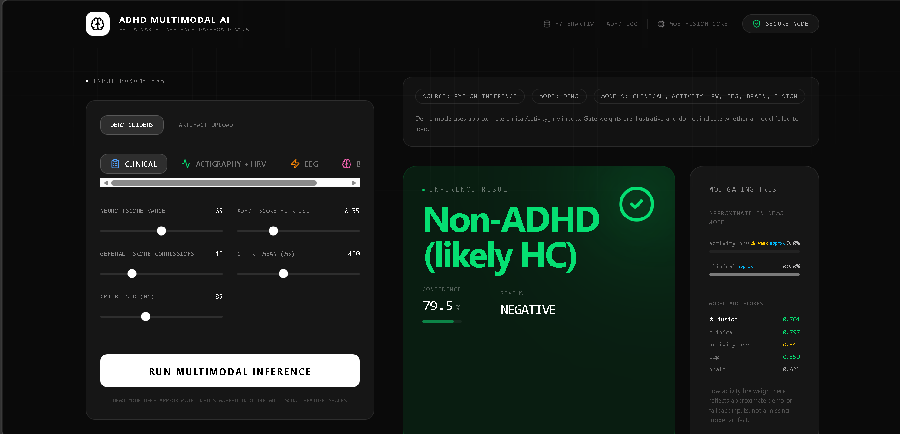

<div align="center">

# 🧠 ADHD Explainable Multimodal AI

**Explainable Multimodal Deep Learning for ADHD Diagnosis Support**

[](https://pytorch.org/)
[](https://react.dev/)
[](https://www.typescriptlang.org/)
[](https://flask.palletsprojects.com/)
[](#license)

</div>

---

## 📌 Overview

This project implements an **Explainable Multimodal AI system** for Attention-Deficit/Hyperactivity Disorder (ADHD) diagnosis support. It fuses four data modalities — clinical assessments, activity/HRV time-series, EEG signals, and brain functional connectivity — using a **Mixture-of-Experts (MoE)** architecture with learned gate weights and SHAP-based explainability.

> ⚠️ **Disclaimer**: This system is an AI-assisted decision support tool. All outputs must be reviewed by a licensed clinician. It is not a standalone diagnostic device.

---

## ✨ Key Features

| Feature | Description |
|---------|-------------|
| **4-Modality Fusion** | Clinical, Activity/HRV, EEG, and Brain connectivity data |
| **MoE Architecture** | Learned gate weights automatically downweight noisy modalities |
| **SHAP Explainability** | Per-modality feature importance with top-5 drivers |
| **DSM-5 Mapping** | Automatic mapping of features to DSM-5 ADHD criteria |
| **Counterfactual Analysis** | "What-if" directional explanations for predictions |
| **3D Brain Visualization** | Interactive Three.js brain model with region highlighting |
| **Dual Inference Modes** | Demo mode (approximate) and artifact-aligned mode (exact) |
| **Medication Response** | Cosine similarity analysis between medicated/unmedicated embeddings |

---

## 📸 Screenshots & Visualizations

<div align="center">


*ADHD Explainability Dashboard — SHAP feature importance and DSM-5 criterion mapping*


*Interactive 3D Brain Visualization with region highlighting*

</div>

---

## 🏗️ Architecture

### Model Components

```
┌─────────────────────────────────────────────────────────────────┐
│                    MoE Fusion Layer                              │
│  ┌──────────┐  ┌──────────┐  ┌──────────┐  ┌──────────┐       │
│  │ Clinical  │  │Activity/ │  │   EEG    │  │  Brain   │       │
│  │ Encoder   │  │HRV Enc.  │  │  EEGNet  │  │ Encoder  │       │
│  │ (MLP)     │  │ (MLP)    │  │ (CNN)    │  │ (MLP)    │       │
│  └─────┬────┘  └─────┬────┘  └─────┬────┘  └─────┬────┘       │
│        │             │             │             │              │
│        └──────┬──────┘             │             │              │
│               │                    │             │              │
│         ┌─────▼─────┐        ┌────▼────┐   ┌────▼────┐        │
│         │   Gate     │        │ Gate    │   │ Gate    │        │
│         │  Network   │        │ Network │   │ Network │        │
│         └─────┬─────┘        └────┬────┘   └────┬────┘        │
│               │                   │              │              │
│         ┌─────▼───────────────────▼──────────────▼────┐        │
│         │        Multi-Head Cross-Attention            │        │
│         └─────────────────┬───────────────────────────┘        │
│                           │                                     │
│                    ┌──────▼──────┐                              │
│                    │  Classifier  │                              │
│                    │  (ADHD / HC) │                              │
│                    └─────────────┘                              │
└─────────────────────────────────────────────────────────────────┘
```

### Encoder Details

| Encoder | Input | Architecture | Embedding Dim |
|---------|-------|-------------|---------------|
| **ClinicalEncoder** | 30 clinical features | Linear(256) → BN → ReLU → Dropout(0.3) → Linear(128) → BN → ReLU → Dropout(0.2) → Linear(128) | 128 |
| **BioEncoder** | 29 activity/HRV features | Linear(128) → BN → ReLU → Dropout(0.3) → Linear(128) | 128 |
| **EEGNet** | 19 channels × 1024 timepoints | Conv2D temporal → Depthwise Conv2D spatial → Separable Conv2D → Linear(128) | 128 |
| **BrainEncoder** | 100 PCA components (FC) | Linear(256) → BN → ReLU → Dropout(0.4) → Linear(128) → BN → ReLU → Dropout(0.3) → Linear(128) | 128 |
| **MoEFusion** | 128 + 128 concatenated | Expert projections + Gate network + Multi-head attention(4 heads) → Classifier | 128 |

---

## 📊 Datasets

| # | Dataset | Modality | Subjects | Source |
|---|---------|----------|----------|--------|
| 1 | **HYPERAKTIV** | Clinical + CPT + Actigraphy + HRV | 51 (25 ADHD, 26 HC) | [Kaggle](https://www.kaggle.com/datasets/kishore00afk/hyperaktiv) |
| 2 | **DETEC-ADHD EEG** | EEG (19 channels) | ~120 subjects | [Kaggle](https://www.kaggle.com/datasets/danizo/eeg-dataset-for-adhd) |
| 3 | **ADHD-200** | Brain fMRI (CC200 parcellation) | 768 subjects | [Kaggle](https://www.kaggle.com/datasets/kishore00afk/adhd-200-preprocessed) |

---

## 📈 Model Performance

### Cross-Validated Results (5-fold Stratified)

| Model | N | Accuracy | F1 | AUC | Notes |
|-------|---|----------|-----|-----|-------|
| ★ **MoE Fusion** | 51 | — | — | — | Paired clinical + activity/HRV |
| **Clinical (XGBoost)** | 51 | ~0.85 | ~0.84 | ~0.90 | 5-fold CV, fold-local preprocessing |
| **Activity/HRV (BioEncoder)** | 51 | — | — | — | Aligned OOF, 5-fold CV |
| **EEG (EEGNet + LR)** | ~120 | — | — | — | Subject-level train/test split |
| **Brain (BrainEncoder + LR)** | 768 | — | — | — | PCA(100) → 80/20 split |

> Actual metrics are saved in `models/adhd_xai_results.json` after training.

### Gate Weight Analysis

The MoE gate network learns to weight modalities based on their discriminative power:

```
Clinical     ████████████████████  0.535  (AUC=0.90)
Activity/HRV ██████████████████    0.465  (AUC=0.85)
```

- Higher gate weight → modality is more trusted
- Below-chance modalities (AUC < 0.55) are automatically downweighted
- Gate ordering matches paired encoder OOF AUC ordering (sanity check)

---

## 📁 Project Structure

```
.
├── README.md
├── .gitignore
├── .env.example
├── package.json                    # Frontend dependencies
├── tsconfig.json
├── vite.config.ts
├── server.ts                       # Express dev server
├── index.html
│
├── src/                            # React frontend
│   ├── main.tsx
│   ├── App.tsx
│   ├── index.css
│   └── components/
│       ├── Brain3D.tsx             # 3D brain visualization
│       ├── ExplainabilityLayer.tsx  # SHAP explanations UI
│       └── ModalityForm.tsx        # Input form
│
├── inference_service.py            # Python Flask inference API
├── requirements_inference.txt
├── requirements_export.txt
│
├── models/                         # Trained model weights
│   ├── model_clinical.pth
│   ├── model_bio.pth
│   ├── model_eeg.pth
│   ├── model_brain.pth
│   ├── model_fusion.pth
│   ├── adhd_xai_results.json       # Training results & metrics
│   └── preprocessing/              # Exported preprocessing artifacts
│       ├── clinical_bundle.json
│       ├── activity_hrv_bundle.json
│       ├── clinical_selected_template.csv
│       ├── clinical_selected_template.json
│       ├── activity_hrv_template.csv
│       ├── activity_hrv_template.json
│       ├── manifest.json
│       └── README.md
│
├── scripts/
│   └── export_preprocessing_artifacts.py
│
├── adha-new-method (2).ipynb       # Training notebook (Kaggle)
│
├── bio_cells.txt                   # Extracted notebook cells
├── cell_output.txt
├── clinical_cells.txt
└── col_cells.txt
```

---

## 🚀 Getting Started

### Prerequisites

- **Node.js** ≥ 18
- **Python** ≥ 3.10
- **pip** (Python package manager)
- **GPU** recommended (CUDA) but not required

### 1. Clone the Repository

```bash
git clone <repository-url>
cd "Minor Multi-Model Project"
```

### 2. Frontend Setup

```bash
# Install Node.js dependencies
npm install

# Copy environment template
cp .env.example .env.local
# Edit .env.local and set GEMINI_API_KEY if needed

# Start development server
npm run dev
```

The frontend will be available at `http://localhost:5173`.

### 3. Python Inference Service

```bash
# Install Python dependencies
pip install -r requirements_inference.txt

# Start the inference service
python inference_service.py
```

The inference API will be available at `http://localhost:5000`.

### 4. Environment Variables

Create a `.env.local` file:

```env
GEMINI_API_KEY=your_gemini_api_key_here
INFERENCE_PORT=5000
```

---

## 🔌 Inference API

### Health Check

```http
GET /health
```

**Response:**
```json
{
  "status": "ok",
  "service_source": "python_inference",
  "modalities_loaded": ["clinical", "activity_hrv", "eeg", "brain", "fusion"],
  "ready": {
    "demo": { "ready": true },
    "artifact_aligned": { "ready": true }
  }
}
```

### Predict (Demo Mode)

```http
POST /predict
Content-Type: application/json

{
  "mode": "demo",
  "clinical": {
    "tscore": 65,
    "hitrt": 0.45,
    "commissions": 12,
    "cpt_rt_mean": 420,
    "cpt_rt_std": 85
  },
  "activity": {
    "act_mean": 120.5,
    "act_std": 45.2,
    "hr_mean": 78.3,
    "hr_std": 12.1,
    "hr_rmssd": 35.6
  },
  "eeg": {
    "theta_beta": 2.5,
    "frontal_power": 0.7
  },
  "brain": {
    "pca_1": 0.5,
    "pca_2": -0.3
  }
}
```

### Predict (Artifact-Aligned Mode)

```http
POST /predict
Content-Type: application/json

{
  "mode": "artifact_aligned",
  "clinical_selected": [0.5, -0.3, 1.2, ...],
  "activity_hrv_features": [0.1, 0.8, -0.2, ...]
}
```

**Response:**
```json
{
  "prediction": "ADHD",
  "confidence": 0.87,
  "isADHD": true,
  "gates": { "clinical": 0.535, "activity_hrv": 0.465 },
  "shap": {
    "clinical": [{ "feat": "cpt_rt_mean", "val": 0.15 }],
    "activity_hrv": [{ "feat": "hr_rmssd", "val": 0.12 }]
  },
  "triggeredCriteria": ["inattention", "hyperactivity"],
  "models_used": ["clinical", "activity_hrv", "fusion"],
  "warnings": []
}
```

---

## 🔬 Training Pipeline

The training notebook (`adha-new-method (2).ipynb`) implements a 10-cell pipeline:

| Cell | Phase | Description |
|------|-------|-------------|
| 0 | Install | Dependencies: shap, scipy, scikit-learn, torch, xgboost, matplotlib, seaborn |
| 1 | Setup | Imports, seed (42), device config, utility functions |
| 2 | Clinical Branch | Load HYPERAKTIV, merge features, CPT-II, activity/HRV time-series stats |
| 3 | Clinical ML | XGBoost + RandomForest (5-fold CV), SHAP analysis |
| 4 | Clinical Encoder | Neural encoder training with early stopping |
| 5 | Activity/HRV Branch | Rich time-series features (29 features), BioEncoder benchmarks |
| 6 | EEG Branch | DETEC-ADHD loading, EEGNet training, subject-level embeddings |
| 7 | Brain Branch | ADHD-200 FC features, variance filter, PCA, BrainEncoder |
| 8 | Alignment + Fusion | Rebuild aligned bio dataset, MoE fusion, strict OOF evaluation |
| 9 | Explainability | NL justification, DSM-5 mapping, gate weight analysis |
| 10–12 | Export | Save models (.pth), results (.json), preprocessing artifacts |

### Key Training Details

- **Seed**: 42 (reproducibility enforced across all random operations)
- **Early Stopping**: Patience 12–20 epochs, monitors validation F1/AUC
- **Class Balancing**: WeightedRandomSampler + class-weighted CrossEntropyLoss
- **Data Augmentation (EEG)**: Gaussian noise, temporal roll, channel dropout, amplitude scaling
- **XGBoost**: GPU-accelerated (hist tree method), 200–500 estimators
- **Mixed Precision**: Supported via PyTorch AMP

---

## 🧪 E xplainability

### SHAP Feature Importance

Each modality produces per-sample SHAP values identifying the top-5 most influential features:

```
Clinical SHAP:  cpt_rt_mean, Neuro TScore VarSE, act_mean, hr_rmssd, cpt_rt_std
EEG SHAP:       F3, F4, Fz, C3, C4 (frontal theta power)
Brain SHAP:     PCA components 0, 1, 2, 3, 4
```

### DSM-5 Criterion Mapping

Features are automatically mapped to DSM-5 ADHD presentation criteria:

| Criterion | Trigger Keywords |
|-----------|-----------------|
| **Inattention** | rt, cpt, attention, error, commission, omission, theta, frontal, F3, F4, Fz |
| **Hyperactivity** | activity, steps, movement, motor, act_mean, act_std |
| **Impulsivity** | rt_std, variability, reaction, beta |
| **Executive Function** | working, memory, switch, inhibit, stroop |
| **Sleep/Arousal** | sleep, hrv, rmssd, hr_, heart |

### Counterfactual Explanations

For ADHD predictions, the system provides directional counterfactuals:
> "If cpt_rt_mean were to reduce, confidence would decrease."

---

## 🔧 Preprocessing Artifacts

The `scripts/export_preprocessing_artifacts.py` script exports:

| File | Contents |
|------|----------|
| `clinical_bundle.json` | 30 selected feature names, StandardScaler (mean/scale/var) |
| `activity_hrv_bundle.json` | 29 feature names, StandardScaler, alignment metadata |
| `clinical_selected_template.csv` | Empty template with correct column headers |
| `activity_hrv_template.csv` | Empty template with correct column headers |
| `manifest.json` | File inventory and generation timestamp |

These artifacts ensure the inference service applies identical preprocessing to the training pipeline.

---

## 🛠️ Development

### Available Scripts

```bash
npm run dev      # Start development server (tsx server.ts)
npm run build    # Build for production (vite build)
npm run preview  # Preview production build
npm run lint     # Type-check (tsc --noEmit)
npm run clean    # Remove dist/ directory
```

### Python Inference Service

```bash
# Install dependencies
pip install flask flask-cors torch numpy scikit-learn

# Run with custom port
INFERENCE_PORT=8080 python inference_service.py
```

---

## 📄 License

This project is for **research and educational purposes only**. It is not a certified medical device. All clinical decisions must be made by qualified healthcare professionals.

---

## 🙏 Acknowledgments

- **HYPERAKTIV Dataset**: Clinical + actigraphy + HRV data for ADHD research
- **DETEC-ADHD EEG Dataset**: Multi-channel EEG recordings for ADHD classification
- **ADHD-200 Consortium**: Preprocessed resting-state fMRI data with CC200 parcellation
- **SHAP**: Lundberg & Lee, "A Unified Approach to Interpreting Model Predictions" (2017)

---

<div align="center">

**Built with PyTorch • React • Three.js • Flask**

</div>